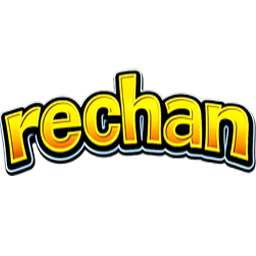
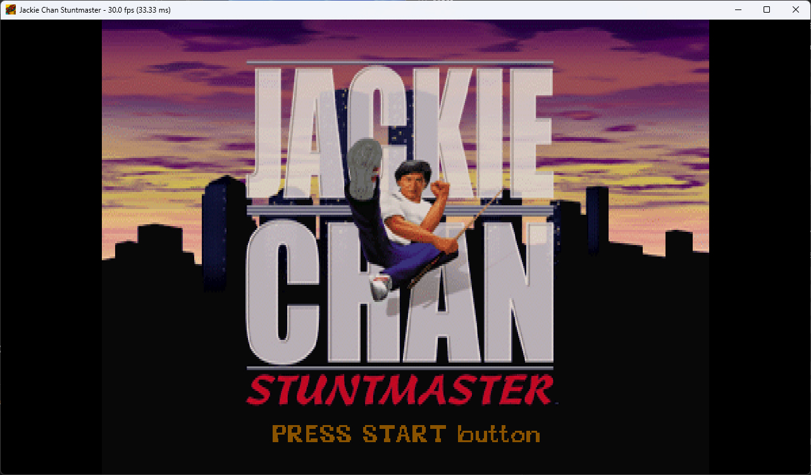
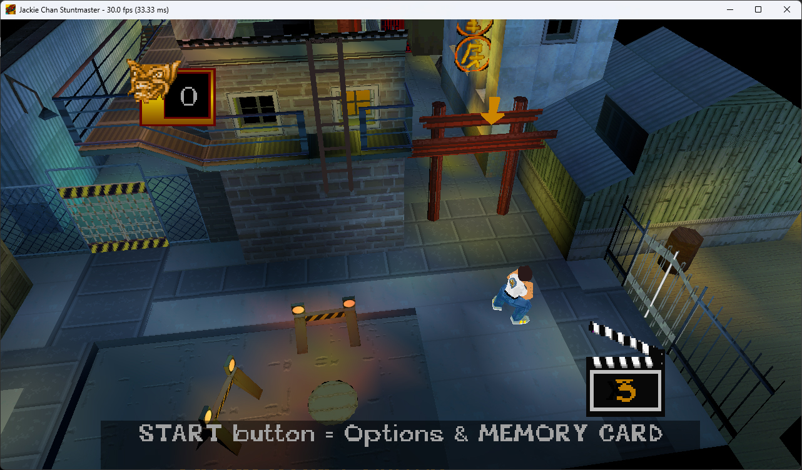
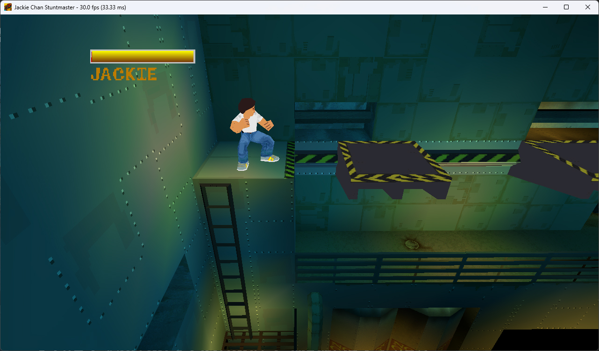

<table align="center">
<tr>
<td valign="middle">

# rechan
**rechan** is a reverse engineering project focused on reimplementing the game:\
**Jackie Chan Stuntmaster**.

### To use this project:
* You **must own a legal copy** of *Jackie Chan Stuntmaster* (SLUS-00684).
* You must extract your own data from your copy.
* All rights to the original game, assets and intellectual property belong to their respective owners.

<br>


</td>

<td align="center" valign="middle" width="256">

</td>
</tr>
</table>

## About
* Target version: **SLUS-00684**
* Development started: **October 2025**

The project focuses on:
* reconstructing game logic and systems
* rebuilding data structures and formats
* matching original runtime behavior

A large part of the work has been dedicated to documentation and understanding
the original codebase before reimplementation.

## Enhancements
Beyond reconstruction, the project also introduces improvements over the original PlayStation version:
- keyboard and mouse support  
- HOR+ widescreen support  
- higher resolution rendering  
- PC-specific settings and enhancements  
- general quality-of-life improvements  

## Screenshots
<p align="center">
  
  
  
</p>

## Build
```bash
git clone --recursive https://github.com/gennariarmando/rechan.git
cd rechan
./premake5.cmd vs2026
```

Open `rechan.slnx` in Visual Studio and build (Release x64).

Output:

```
bin/rechan.exe
```

## Game Data & Extraction
Game data is **not included**.
You must obtain a valid `.bin` from your own copy of the game.
Extraction tool:

```
tools/extract_assets/rechan_assets_extractor.bat
```

Usage:
* Run the tool
* Drag & drop the `.bin` file into the console
* Press Enter

Output:
```
rechan_assets/
```

## Run

Copy:
```
bin/rechan.exe
```

into:
```
rechan_assets/
```

## FAQ
**Is this a PS1 emulator?**  
No. rechan is a reimplementation, the game logic is rewritten in C++ for PC and does not emulate PS1 hardware.

**Will this work with PAL versions?**
Currently only the NTSC-U version (**SLUS-00684**) is targeted. The PAL version is not supported and may differ in data layouts.

**Will this ever support original PS1 hardware?**  
No. That is not a goal of this project.

**Can I contribute?**  
Yes. Documentation, data formats, and behavior analysis are all welcome.

## License
MIT License.

Applies only to this codebase.
Does not apply to the original game or its assets.
